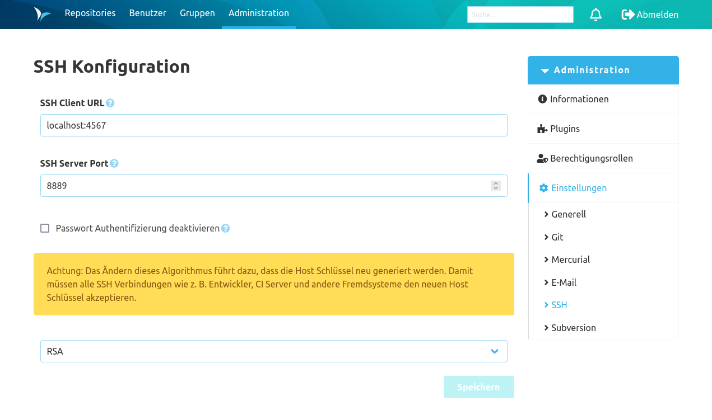

Wenn das SSH-Plugin installiert ist, gibt es in der Administrations-Oberfläche unter Einstellungen einen zusätzlichen Tab "SSH". Hier wird die globale SSH-Konfiguration für die SCM-Manager Instanz verwaltet.

### SSH Client URL
Die SSH Client URL bestimmt über welche URL sich Nutzer per SSH zum Server verbinden können. Wenn keine URL eingetragen ist, wird der Hostname auf Basis der Base URL aus den globalen Einstellungen verwendet.

Man kann hinter die Client URL mit einem Doppelpunkt ":" getrennt einen "externen" Port eintragen. Dies ist sinnvoll, wenn man den SSH-Port auf einen anderen Port mappt (Port-Forwarding), welcher von außerhalb erreichbar ist. Wenn dieser Port eingetragen ist, wird er in den SSH-Befehlen (z. B. zum Klonen eines Repository) eingetragen.

### SSH Server Port
Der SCM-Manager öffnet den eingetragenen TCP Port für den SSH Support.

### Passwort Authentifizierung deaktivieren
Über diese Checkbox kann die Authentifizierung mit Benutzername / Passwort per SSH deaktiviert werden. Der SSH Server akzeptiert damit nur noch eine Authentifizierung mittels "public key".

