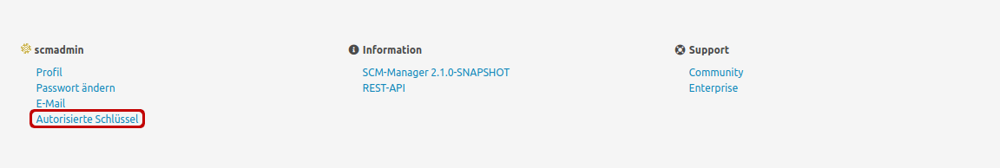
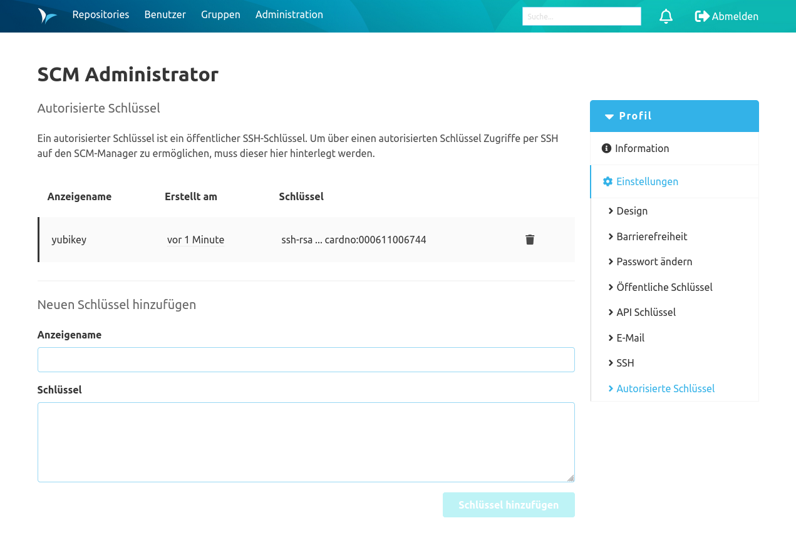

Für die Authentifizierung mit Public Key muss dieser für den angemeldeten Benutzer hinterlegt werden. 
Dazu kann der Benutzer auf den Link "Autorisierte Schlüssel" in der Fußzeile des SCM-Managers klicken, um zu den Kontoeinstellungen zu gelangen.

Unter dem Punkt Einstellungen/Autorisierte Schlüssel können nun die öffentlichen Schlüssel gepflegt werden.

