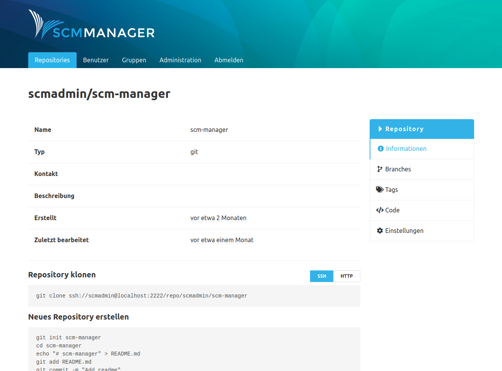
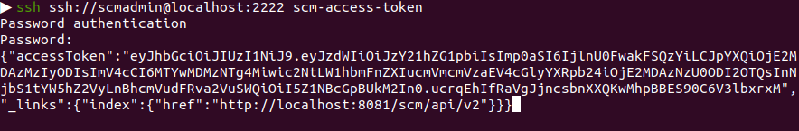

### Repository Befehle
Auf der Informationsseite eines Repository gibt es die Möglichkeit über einen Schalter die CLI-Befehle zwischen HTTP und SSH umzuschalten. 
Die präferierte Checkout-Variante kann in den persönlichen Nutzereinstellungen im Bereich "SSH" vorausgewählt werden.

### Zugangstoken Befehl
Mit dem Zugangstoken Befehl bekommen Sie einen neu generierten Zugangstoken zurück, 
welcher die Berechtigung des authentifizierten Benutzers hat. 
Zusätzlich bekommen Sie den Link zum API Index im [HAL Format](http://stateless.co/hal_specification.html).

Beispiel: `ssh ssh://scmadmin@localhost:2222 scm-access-token`

