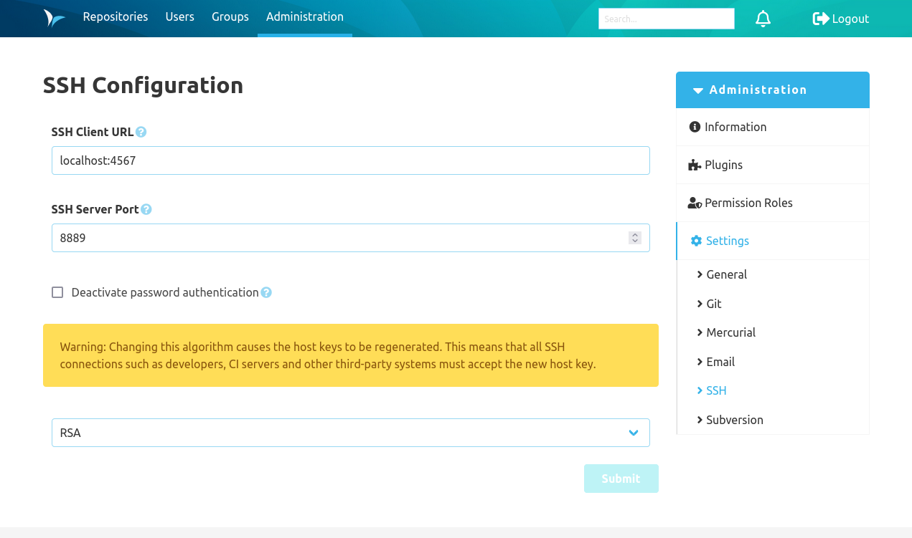

Once the SSH plugin is installed, there is a "SSH" tab in the administration navigation menu. This is where the global SSH configuration is managed.

### SSH client URL
The SSH client URL defines the URL that users can use to connect to the server via SSH. If no URL is provided, the hostname is created based on the base URL from the global settings.

It is possible to provide an "external" port by adding it behind a colon (":"). This could be necessary if the SSH port maps to a different port (port forwarding), which is available from outside. If a port is provided, it is automatically included in the SSH commands (e.g. to clone a repository).

### SSH server port
SCM-Manager opens the provided TCP port for SSH support.

### Deactivate password authentication
The checkbox "Deactivate password authentication" can be used to deactivate the authentication with username and password for SSH. If this option in used, the SSH server only accepts authentication with "public key".

