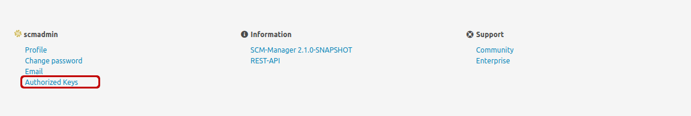
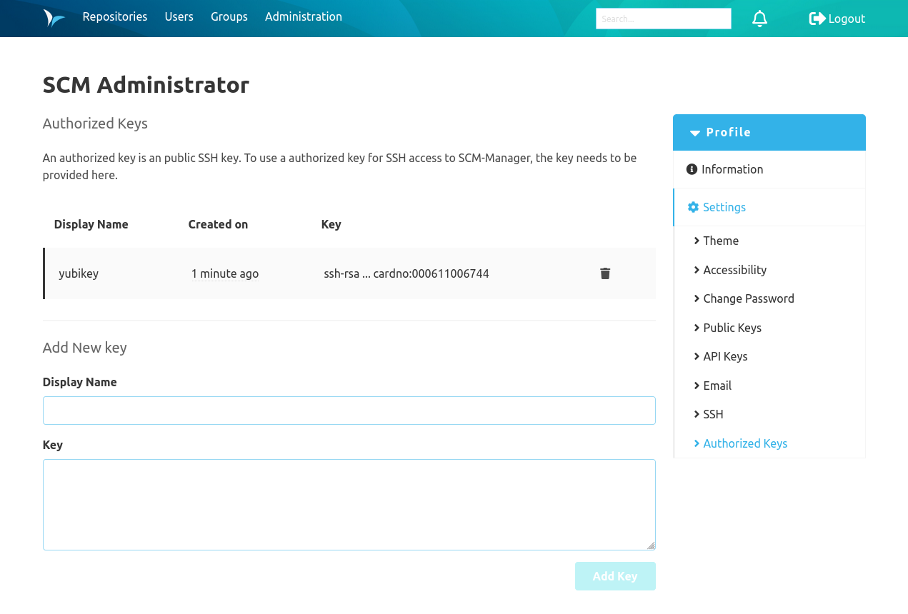

To use a public key for authentication for the current user, the key needs to be provided for the user. 
This can be done by clicking on "Authorized Keys" under the username in the footer of SCM-Manager.

There, a public key can be provided.

