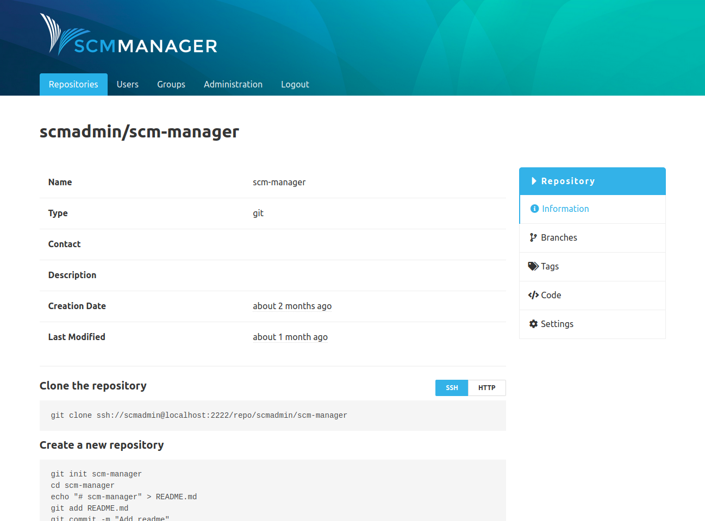

### Repository Commands
On the information page of the repositories the CLI commands can be switched between HTTP and SSH.
The preferred checkout variant can be preselected in the personal user settings in the "SSH" section.

### Access Token Command
Using the access token command you can get a new access token for SCM-Manager which have the same permissions as the authenticated user.
Also you get the link to the api index in [HAL format](http://stateless.co/hal_specification.html).

Example: `ssh ssh://scmadmin@localhost:2222 scm-access-token`

 
